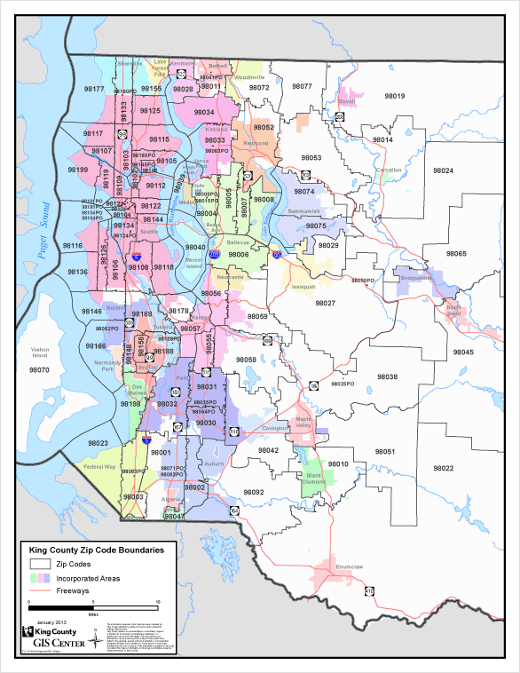
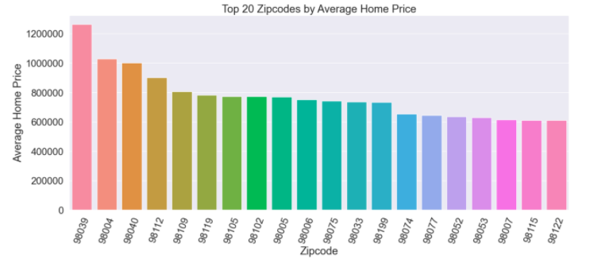
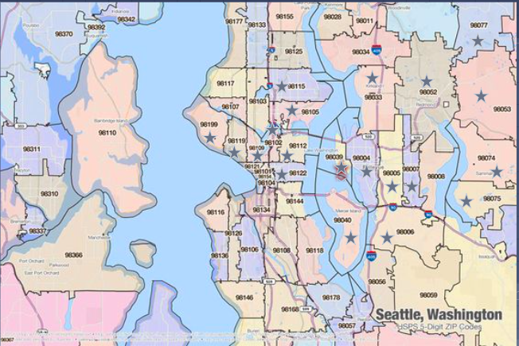
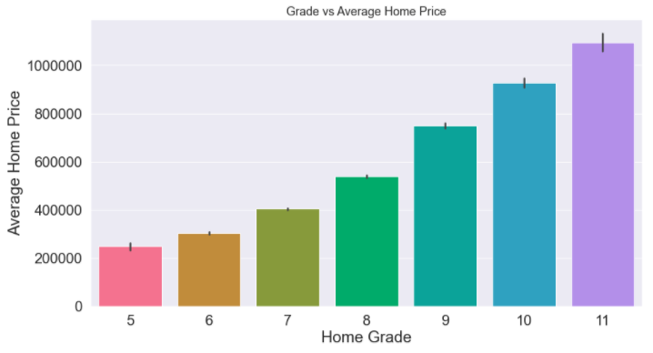
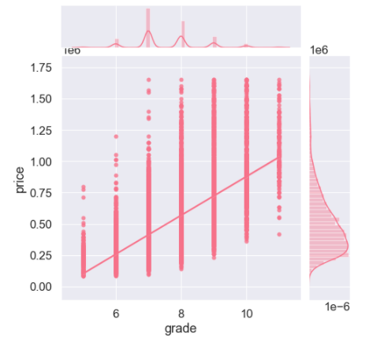
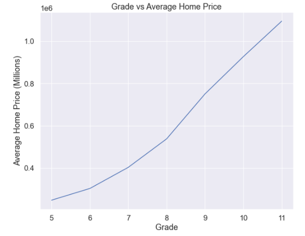
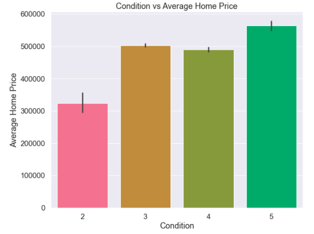
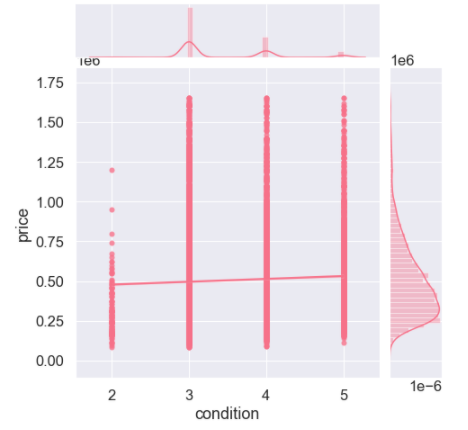

# Analysis of Home Prices in King County, Washington, USA
***

## Business Problem
***

A property investor is looking to "flip" houses in King County, WA for profit. "Flipping houses" is a term used for the action of buying property (in this case houses) that are in poor to average conditions in a good, well-established neighborhood (most likely in a expensive housing market) for cheap and renovating those houses and selling them for higher than they were bought for in order to make profit. The property investor wants to know if King County, WA is a good housing market to invest in and flip houses for profit.

## Objectives
***

The objectives of this analysis was to gain presepctive and understanding of the King County housing market so that the stakeholder, a property investor looking to flip houses in King County for profit, has the information they need to succeed in their endeavours. The data used in this analysis was obtained from the [King County Website](https://www.kingcounty.gov/services/data.aspx) along with a [pdf](https://www.kingcounty.gov/depts/assessor/Reports/area-reports/2017/residential-westcentral/~/media/depts/assessor/documents/AreaReports/2017/Residential/013.ashx) also obtained from the King County government website that gives more information about the dataset.

## Data Obtained from King County Website
***
* kc_house_data.csv
    * A subset of public data provided the King County website
    * A description of this data set was obtained from [kaggle website](https://www.kaggle.com/harlfoxem/housesalesprediction): "This dataset contains house sale prices for King County, which includes Seattle. It includes homes sold between May 2014 and May 2015."
    * Brief description of columns in this dataset:
        * id - Unique identifier for house
        * date - Date house was sold
        * price - Sales price of home
        * bedrooms - Number of bedrooms
        * bathrooms - Number of bathrooms
        * sqft_living - Square footage of living area
        * sqft_lot - Square footage of lot
        * floors - # floors (levels) in house
        * waterfront - Number from 0 to 1 reflecting if house is categorized as a waterfront property
        * view - Number from 0 to 4 reflecting quality of sceanic view
        * condition - Number from 1 to 5 reflecting the overall condition of the property
        * grade - Number from 1 to 13 refelecting the overall grade given to the property, based on King County grading system
        * sqft_above - Square footage of living area above ground/ from basement
        * sqft_basement - Square footage of the basement
        * yr_built - Year house was built
        * yr_renovated - Year house was renovated
        * zipcode - zip code
        * lat - Latitude coordinate
        * long - Longitude coordinate
        * sqft_living15 - Average square footage of living area of the nearest 15 neighbors

## Other resources
***
[Slideshow url]()

[Video url]()

[Blog Post URL]()

[Data Cleaning](data_cleaning.ipynb)

[Stakeholder Questions](Stakeholder_questions.ipynb)

[Linear Regression](EDA_linear_regression.ipynb)

## Proposed Questions
***

### Question 1: Which Zipcodes have the Highest Average Home Price?

#### Graphics
After data was cleaned and organized (see Access to cleaned database notebooks), exploratory data analysis was performed and the following graph was created using the Python data visualization library, Seaborn. The following visualization displays the top 20 zipcodes in King County, WA in terms of price of homes

***

#### Observations and Conclusions
The visualization above shows the top 20 zipcodes according to average home price. As you can see from the map above (or by conducting a simple google search), a majority of these zipcodes are near the main city of Seattle, WA. 

#### Recommendations
I would recommend the property investor to flip houses in these zipcodes so that they can make more profit off of their rennovations. These a majority of the zipcodes reside outside of the main city of Seattle, WA. These zipcodes are beneficial for home owners who have families or do not want to live within the hustle and bustle of the city and are looking for a more tranquil environment, without being too far from the city. Being close to Seattle is a major attraction to many home buyers since it is most likely where they work or where more job opportunitites are available.

***

The above information is from a [pdf](https://www.kingcounty.gov/depts/assessor/Reports/area-reports/2017/residential-westcentral/~/media/depts/assessor/documents/AreaReports/2017/Residential/013.ashx) that was obtained from the King County government website. This information will be used for insight on the following questions.

***
### Question 2:  What Grade of Homes Sell at the Highest Average Price?

#### Graphics
The visualizations below demonstrate the grades of homes according to the home price.

#### Observations and Conclusions
The above graphics show that the price of the houses increases as the grade increases. This makes sense since most home buyers are looking to buy homes that have little or no rennovation to be done. Even though the building grades range from 1-13, after removing outliers in the data, we found that a majority of homes sold in King County were from grades 5-11.

#### Recommendations
I would recommended to the stakeholder to not hold back on construction and rennovations. As you can see from the chart and graphics provided above, the homes that sell at the highest price are homes with grades of 11. A grade of 11 is described as "Custom design and higher quality finish work, with added amenities of solid woods, bathroom fixtures and more luxurious options." This shows that home buyers are willing to pay more for a home that is well constructed and higher quality. The property investor can cheap out on renovations and create an average house, but they will not see a huge return on investment. If the property owner rennovates the homes to have a building range from 9-13, I believe they will see a great return on investment.

***
### Question 3: What Condition of Homes Sell at the Average Highest Price?

#### Graphics
The visualizations below demonstrate the condition of homes according to home price. The condition is based off of the age and grade of the homes.

#### Observations and Conclusions
The graphics above show that there is an increase in home prices when the home condition is higher. This makes sense since most home buyers are looking to buy homes that are in good condition so that they do not have to further renovate or deal with construction issues. Even though the building conditions range from 1-5, after removing outliers in the data, we found that a majority of homes sold in King County had condition ratings from 2-5, which makes since since no one want to buy a home that is seriously deteriorated and needs many repairs like homes of poor condition (1 condition rating). A condition rating of 5 seems to be the most profitable. it seems that houses at condition 3 sell higher than houses at condition 4. 

#### Recommendations
I would recommend that the property investor flip homes in conditions 2-3 so that they can negotiate a lower price with the seller. Using the data I obtained, I would recommend the home owner to rennovate the home to the highest possible condition, being 5, which is described as "Excellent maintenance and updating on home. Not a total renovation", which would help them to sell the house at a higher price.
